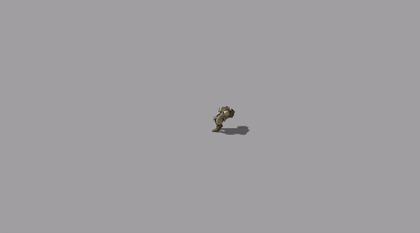

# Unity Pixel Monster Maker using SDFs




This repository hosts the Unity Pixel Monster Maker project, an innovative approach to creating and rendering pixelated monsters using Signed Distance Functions (SDFs) within Unity's Built-In Render Pipeline.

## Project Overview

The Unity Pixel Monster Maker utilizes Raymarching algorithms to render SDFs effectively within Unity. This implementation writes to the depth buffer, ensuring that shadows and mesh intersections are handled correctly, providing a more realistic and integrated rendering of the SDF-based objects within Unity's existing render pipeline. This is done using mesh cubes as conservative estimates of SDF sizes to limit the amount of raymarching performed each frame on the GPU. Only SDFs within the viewing bounds of it's parent mesh cube will be rendered.

## Features

- **Raymarching Algorithm**: Implements Raymarching to render SDFs, a technique that calculates ray intersections using distance estimates obtained from a signed distance function.
- **Integration with Unity's Built-In Render Pipeline**: Seamlessly integrates with Unity's existing rendering pipeline, writing to the depth buffer to support shadows and proper mesh intersections.
- **Dynamic Monster Creation**: Monsters are procedurally generated using a combination of SDF primitives. The monster design is randomized over time in the base scene, ensuring a unique experience with each iteration.
- **Procedural Terrain Generation using Compute Shaders**: The terrain is procedurally generated using heightmap values calculated using compute shaders.

## Repository Link

This project makes use of additional utilities from another repository which can be found here: [Unity JSON Utilities](https://github.com/tblaney/unity_json). Ensure to clone or download this repository as well for full functionality.

## Getting Started

To get started with the Unity Pixel Monster Maker:

1. **Clone this repository**:
   ```bash
   git clone https://github.com/your-username/unity-pixel-monster-maker.git
